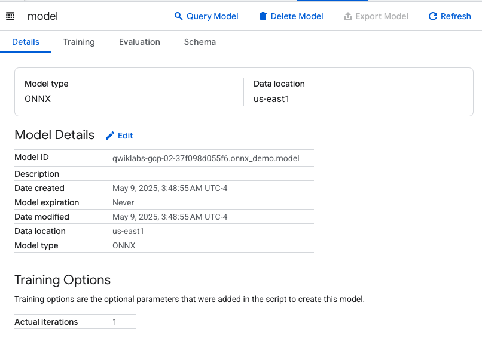
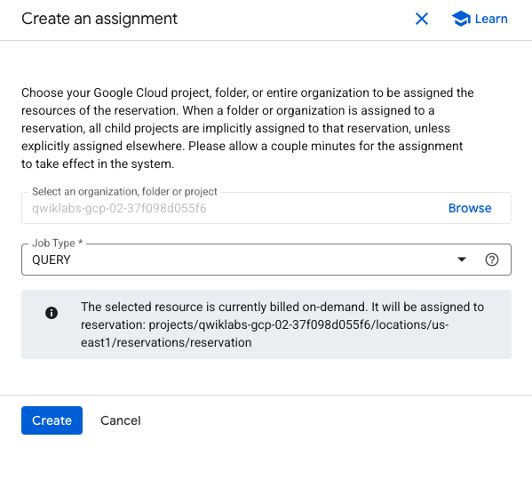

# GCP-LAB-Streamlining-Wildlife-Image-Classification-in-BigQuery-with-an-Imported-Model
Streamlining Wildlife Image Classification in BigQuery with an Imported Model

##### Overview
In this lab, you learn how to help streamline an image classification workflow in BigQuery using an imported model (PyTorch model created in ONNX format), and Google SQL queries.

As a new data analyst at Cymbal Media and Entertainment, you have been tasked to experiment with an imported model and BigQuery Machine Learning for inference to classify wildlife images. This project aims to automate the image classification process, simplify content creation, and potentially build a larger database of wildlife images for future content on Cymbal's streaming platform.

ONNX is an open format built to represent machine learning models. ONNX defines a common set of operators — the building blocks of machine learning and deep learning models — and a common file format to enable AI developers to use models with a variety of frameworks, tools, runtimes, and compilers.

BigQuery is a fully managed, AI-ready data analytics platform which helps you maximize value from your data and is designed to be multi-engine, multi-format, and multi-cloud. One of its key features is BigQuery Machine Learning for inference, which lets you create and run machine learning (ML) models by using SQL queries.


###### Running ML models using GoogleSQL Queries

Usually, performing ML or artificial intelligence (AI) on large datasets requires extensive programming and knowledge of ML frameworks. This restricts solution development to a small set of people within each company, and excludes data analysts who understand the data but have limited ML knowledge and programming expertise. However, with BigQuery ML, SQL practitioners can use existing SQL knowledge, skills, and tools to build and to generate results from models built with ONNX, and stored in a cloud storage bucket. This helps companies with model choice, and flexibility from an MLOPs perspective. It also helps scale their ML initiatives.


###### The image dataset
The images used in this lab are from the Animals Detection Images Dataset on Kaggle.


###### Objectives
In this lab, you learn how to:

. Create a Cloud Resource connection.
. Grant permissions to the connection's service account.
. Create a BigQuery dataset and tables.
. Import the ONNX model into BigQuery.
. Classify images using the imported model.


### Task 1. Create a Cloud Resource connection

In this task, you create a Cloud Resource connection in BigQuery, so you can import the images from Cloud Storage into the object table within your dataset.

>Note: Create the resource connection using the Google Cloud Region assigned in your lab guide. We also recommend you create the dataset in this region, which will help reduce errors in the lab.

1. In the Google Cloud Console, on the Navigation menu, click BigQuery.

2. The Welcome to BigQuery pop-up is displayed. Click DONE.

3. To create a connection, click + ADD, and then click Connections to external data sources.

>Note: Alternatively, if you do not see the option for + Add followed by Connections to external data sources, you can click + Add data, and then use the search bar for data sources to search for Vertex AI. Click on the result for Vertex AI.

4. In the Connection type list, select Vertex AI remote models, remote functions and BigLake (Cloud Resource).

5. In the Connection ID field, enter onnx_conn for your connection.

6. For Location type, choose Region.

7. For Region, choose us-east1.

8. Click CREATE CONNECTION.

9. Click GO TO CONNECTION.

10. You will also see the connection added under the External Connections section of your project in the BigQuery Explorer. In the Connection info pane, copy the service account ID to a text file for use in the next task.


### Task 2. Review images, and files, and grant access to service account
In this task, you review images and files (ONNX model and classifier csv), and grant IAM permissions to the Cloud Resource connection's service account.

##### Review the images and ONNX model on Cloud Storage

Before you dive into this task to grant permissions to the resource connection service account, review the images, the model and the classifier.csv file as they are stored in the Cloud Storage bucket.

1. In the Google Cloud console, select the Navigation menu (Navigation menu icon), and then select Cloud Storage > Buckets.

2. Click on the qwiklabs-gcp-02-37f098d055f6-bucket bucket.

3. The bucket contains the gsp1248 folder, open the folder. You will see three items in it:

. The images folder contains all images you will classify. Feel free to access the images folder and review the images. You should see an image of a lion, black swan, hippopotamus, American black bear, and king crab.
. The resnet18.onnx file is the model file. You will import it into BigQuery and use it in later tasks.
. The classifier.csv file will be used with the model within a query to classify the images.


##### Grant IAM permissions to the connection's service account

Granting IAM permissions to the resource connection's service account before you start working in BigQuery will ensure you do not encounter access denied errors when running queries.

1. Return to the bucket root.

2. Click PERMISSIONS.

3. Click GRANT ACCESS.

4. In the New principals field, enter the service account ID you copied earlier.

5. In the Select a role field, enter Storage Object, and then select Storage Object Admin role.

6. Click Save.

The result is the service account id now includes the Storage Object Admin role.


### Task 3. Create the dataset and tables in BigQuery

In this task, you create a dataset for the project, an object table to store the images, and a table for the classification list.


##### Create a dataset
1. In the Google Cloud console, select the Navigation menu (Navigation menu icon), and then select BigQuery.

2. In the Explorer panel, for qwiklabs-gcp-02-37f098d055f6, select View actions (More menu icon), and then select Create dataset.

You create a dataset to store database objects, including tables and models.

3. In the Create dataset pane, enter the following information:

| Field	| Value |
| Dataset ID	| onnx_demo |
| Location type > Region |	select us-east1 |
Leave the other fields at their defaults.

4. Click Create Dataset.

The result is the onnx_demo dataset is created and listed underneath your project in the BigQuery Explorer.


##### Create the object table for the images
With the dataset created, you can now create the object table referencing the images in the bucket.

To create the object table you will use a SQL query.

1. Click the + to create a new SQL query.

2. In the query editor, paste the query below.

```
CREATE OR REPLACE EXTERNAL TABLE
  `onnx_demo.wildlife`
WITH CONNECTION `us-east1.onnx_conn`
OPTIONS (
  object_metadata = 'SIMPLE',
  uris = ['gs://qwiklabs-gcp-02-37f098d055f6-bucket/gsp1248/images/*']
  );
```

3. Run the query.

The result is the wildlife object table is added to the onnx_demo dataset and loaded with the URI (the cloud storage location) of each animal image.

4. In the Explorer, click on the wildlife table and review the schema and details.


##### Create the table for the classification list
To create the table classification list you will use a SQL query.

1. Click the + to create a new SQL query.

2. In the query editor, paste the query below.

```
LOAD DATA OVERWRITE onnx_demo.classifier
(ID INT64,Classification STRING)
FROM FILES (
  format = 'CSV',
  uris = ['gs://qwiklabs-gcp-02-37f098d055f6-bucket/gsp1248/classifier.csv']);
```


3. Run the query.

The result is the classifier table added to the onnx_demo dataset, loaded with the ID and the classification of each item in the dataset. This includes wildlife you will classify later in the lab.

4. In the Explorer, click on the classifier table and review the schema and details. Feel free to query the table to review how it classifies each item. Note: the table contains many other items, not just wildlife (like animals, fish, insects and birds).


### Task 4. Import the model into BigQuery
In this task, you import the resnet18 ONNX model into BigQuery so you may use it to classify images.

1. Click the + to create a new SQL query.

2. In the query editor, paste the query below.


```
CREATE OR REPLACE MODEL `onnx_demo.model`
 OPTIONS (MODEL_TYPE='ONNX',
  MODEL_PATH='gs://qwiklabs-gcp-02-37f098d055f6-bucket/gsp1248/resnet18.onnx')
```

3. Run the query.

The result is the model is added to the onnx_demo dataset in the models section.


4. In the Explorer, click on the model and review the details




### Task 5. Classify images using the imported ONNX model
In this task, you reserve a slot, assign it to your project, and use a query to classify new images with the ONNX model.


###### Add a slot reservation
In order for you to use the ONNX model, you will have to create a slot reservation, and assign it to your project.

1. From the BigQuery menu click Capacity Management.

2. On the Capacity Management page, click CREATE RESERVATION.

3. On the Create Reservation page, enter reservation as the reservation name.

4. Choose the us-east1 for the Location.

5. Choose Small (100 Slots) for the Max reservation size selector option.

6. Click SAVE.


##### Assign the slot reservation to your project.

1. Click on the Reservation Actions button (vertical 3 dots) for your reservation.

2. In the pop-up menu, click Create Assignment.

3. In the Create an Assignment pop-up window, you will see the Job Type default to QUERY. Keep this option.

4. Click BROWSE.

5. In the pop-up choose the project name. The project is added to the Select an organization, folder or project field.

6. Click CREATE.

The result is the project is assigned to the slot reservation you just created.



7. Wait 2 minutes. The slot reservation assignment takes some time to apply to the account.


##### Use the model to classify images
1. Return to BigQuery Studio.

2. Click the + to create a new SQL query.

3. In the query editor, paste the query below.

```
SELECT * FROM `qwiklabs-gcp-02-37f098d055f6.onnx_demo.classifier`
WHERE EXISTS (
SELECT
   1
FROM
   ML.PREDICT(MODEL onnx_demo.model,
      (
      SELECT
      ML.RESIZE_IMAGE(ML.DECODE_IMAGE(DATA),
         224,
         224,
         FALSE) AS input
      FROM
         `onnx_demo.wildlife`
      )
   )
WHERE
   class_label = ID - 1
)
```

4. Run the query.

The result is the images are each classified by row with the ID and the predicted classification based on the ONNX model.


##### Congratulations!
You successfully created a Cloud Resource connection, granted access to the service account for the connection, created a dataset and tables, imported an ONNX model into BigQuery, and classified images using the model.


